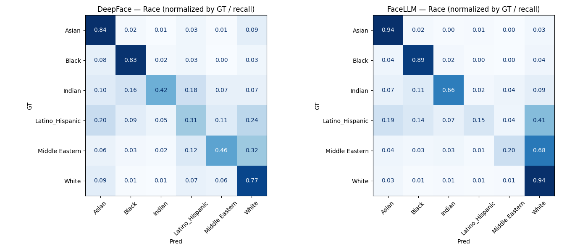
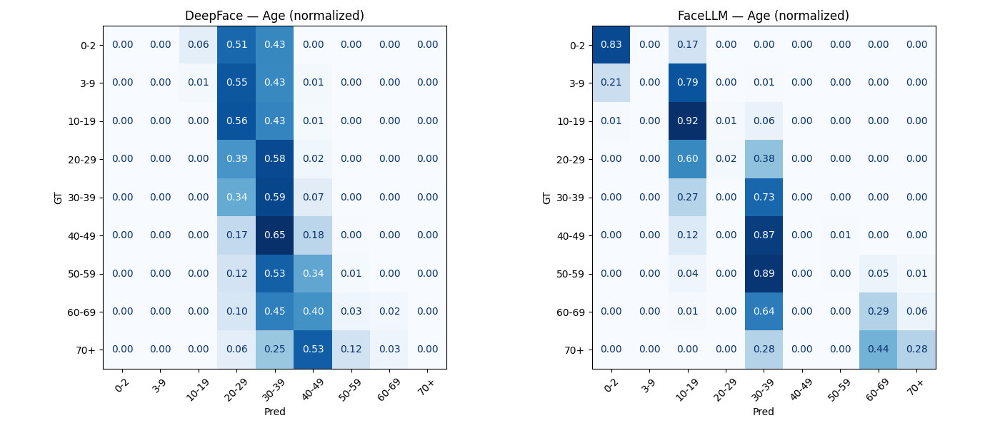
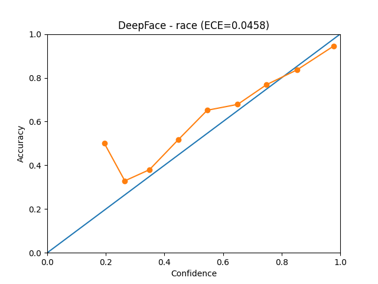
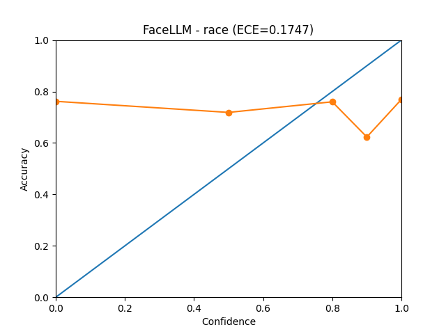
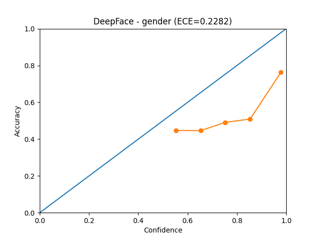
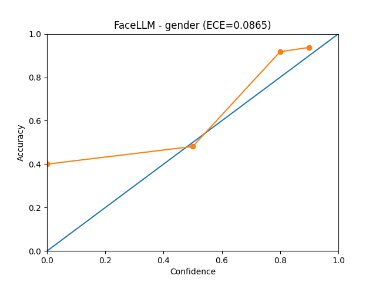
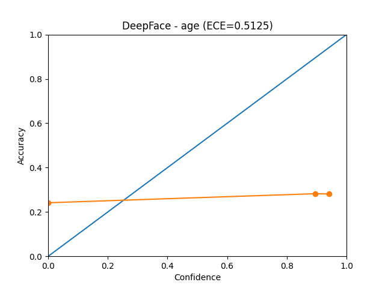
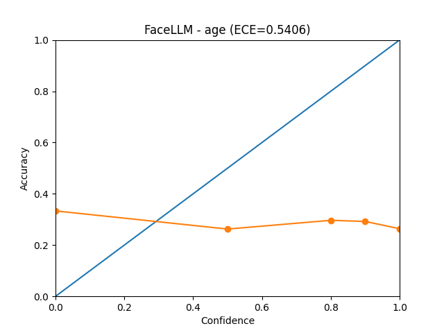

# Face Attribute Analysis with Vision-LLMs vs Specialized Models

## Academic Research Project — Facial Attribute Prediction Benchmark

This project was developed during an exchange semester at the University of Ljubljana,
Faculty of Computer and Information Science, within the Image-Based Biometrics course (research track).

This repository presents a comparative evaluation between:

- **FaceLLM** (Vision-Language Model, prompt-based inference)
- **DeepFace** (Specialized deep-learning facial attribute model)

The objective is to assess how a generalist Vision-LLM performs against a dedicated facial analysis system on structured attribute prediction tasks.

The evaluation is conducted on a curated subset (3,000 images) of the **FairFace dataset**, focusing on:

- Gender
- Race / Ethnicity (coarse taxonomy)
- Age (binned categories)

---

## 🎯 Research Motivation

Vision-Language Models (VLMs) are increasingly capable of performing complex multimodal tasks. However, their reliability on structured, bias-sensitive tasks such as facial attribute prediction remains unclear.

---

## 🧪 Experimental Setup

### Dataset

- FairFace (subset of 3,000 images)
- Ground-truth harmonized to a coarse taxonomy
- East Asian and Southeast Asian merged into **Asian**
- Binary gender
- Age binned

Taxonomy details available in:
taxonomy_fairface.md

---

## ⚙️ Pipeline Overview

### 1️⃣ Inference

Both models were run independently on 3,000 FairFace images.

- DeepFace inference via `infer_deepface.py`
- FaceLLM inference via `infer_facellm.py`
- Executed in parallel SLURM jobs (FRIDA cluster)
- Containerized environment for reproducibility

Raw outputs stored in:
results/raw/

---

### 2️⃣ Output Normalization

Both models output heterogeneous formats:

- DeepFace → structured probabilistic output
- FaceLLM → JSON responses conditioned by prompt available in : prompt.md

Normalization steps:

- Markdown-wrapped JSON stripping (FaceLLM)
- Label harmonization
- Age bin alignment
- Race taxonomy projection
- Invalid outputs removed (<1% due to network/runtime errors)

Scripts:
scripts/preprocessing/

---

### 3️⃣ Evaluation

Evaluation performed using:

- Accuracy
- Macro-F1 (for race)
- Confusion matrices (raw and normalized)

Metrics computed using `scikit-learn`.

Evaluation scripts:
scripts/evaluation/

Results stored in:
results/

---

## 📊 Key Observations

### 🔹 Gender

**Accuracy**

- DeepFace: **68.48%**
- FaceLLM: **88.29%**

DeepFace shows a strong directional bias toward predicting **Male**:

- Female recall: **37.6%**
- Male recall: **95.9%**

In contrast, FaceLLM exhibits the opposite asymmetry:

- Female recall: **99.3%**
- Male recall: **78.5%**

DeepFace heavily misclassifies females as males (~62%), whereas FaceLLM maintains near-perfect detection of females but misclassifies ~21% of males as female.

Overall, FaceLLM demonstrates significantly better gender balance and global performance.

---

### 🔹 Race (Coarse Taxonomy)

**Macro-F1**

- DeepFace: **0.604**
- FaceLLM: **0.607**

Both models achieve very similar macro-F1 scores, indicating comparable overall multi-class balance. However, their confusion structures differ substantially.

#### DeepFace — Observations from the normalized confusion matrix:

- Strong performance on:
  - Asian (0.84 recall)
  - Black (0.83)
  - White (0.77)
- Weak performance on:
  - Indian (0.42)
  - Latino_Hispanic (0.31)
  - Middle Eastern (0.46)

Systematic confusions:

- Indian frequently misclassified as Black (16%) or Latino_Hispanic (18%)
- Latino_Hispanic confused with White (24%) and Asian (20%)
- Middle Eastern often predicted as White (32%)

DeepFace tends to absorb ambiguous groups into dominant classes (especially White).

---

#### FaceLLM — Observations from the normalized confusion matrix:

- Very strong recall for:
  - Asian (0.94)
  - Black (0.89)
  - White (0.94)
- Improved Indian recall (0.66 vs 0.42 for DeepFace)
- Still weak on:
  - Latino_Hispanic (0.15)
  - Middle Eastern (0.20)

Key pattern:
FaceLLM strongly collapses:

- Latino_Hispanic → White (41%)
- Middle Eastern → White (68%)

This suggests a different bias structure: while DeepFace distributes confusion across multiple groups, FaceLLM heavily maps ambiguous ethnicities to **White**.

Despite similar macro-F1, the _nature_ of errors differs significantly.

---

### 🔹 Age (Binned Classification)

#### Exact Match Accuracy

- DeepFace: **26.78%**
- FaceLLM: **29.25%**

#### Macro-F1

- DeepFace: **0.106**
- FaceLLM: **0.237**

FaceLLM clearly outperforms DeepFace in balanced age classification.

---

### 🔍 Age Confusion Matrix Analysis (Normalized)

#### DeepFace

The normalized matrix shows a strong collapse into the **30–39** and **40–49** bins.

Patterns:

- Younger groups (0–2, 3–9, 10–19) are largely predicted as 20–39
- Elderly groups (60–69, 70+) are frequently shifted toward 40–49
- Very low diagonal dominance except for middle-aged bins

DeepFace exhibits a strong **central age bias**, compressing predictions toward mid-adulthood.

---

#### FaceLLM

The matrix shows:

- Strong recall for:
  - 0-2 (0.83)
  - 10–19 (0.92)
  - 30–39 (0.73)
- More structured diagonal pattern than DeepFace
- Better separation between early adulthood and middle age
- But 30-39 is too often predict

While still imperfect, FaceLLM maintains clearer age stratification.

---

### 📏 Age Distance Metrics (Ordinal Perspective)

Instead of strict exact-bin accuracy, age can be interpreted ordinally.

#### Mean Absolute Bin Distance

- DeepFace: **1.17 bins**
- FaceLLM: **0.94 bins**

FaceLLM predictions are closer to GT on average.

#### Tolerance Accuracy

| Metric  | DeepFace | FaceLLM |
| ------- | -------- | ------- |
| ±1 bin  | 69.3%    | 82.4%   |
| ±2 bins | 88.8%    | 95.5%   |

FaceLLM is substantially more stable under ordinal tolerance, indicating better relative age estimation even when exact bin match fails.

---

## 📈 Confidence & Calibration Analysis

In addition to classification performance, we evaluate whether confidence scores are **informative and calibrated**, using reliability diagrams and Expected Calibration Error (ECE).

ECE measures the gap between predicted confidence and observed accuracy (lower is better).

---

# 🔹 Race

## DeepFace — Race Calibration

- ECE: **0.0458** (very well calibrated)
- Confidence spans the full [0,1] range
- Accuracy increases monotonically with confidence:

| Confidence Bin | Mean Confidence | Accuracy | Count |
| -------------- | --------------- | -------- | ----- |
| (0.1, 0.2)     | 0.20            | 0.50     | 2     |
| (0.2, 0.3)     | 0.27            | 0.33     | 298   |
| (0.3, 0.4)     | 0.36            | 0.38     | 566   |
| (0.4, 0.5)     | 0.45            | 0.52     | 447   |
| (0.5, 0.6)     | 0.55            | 0.65     | 290   |
| (0.6, 0.7)     | 0.65            | 0.68     | 224   |
| (0.7, 0.8)     | 0.75            | 0.77     | 212   |
| (0.8, 0.9)     | 0.85            | 0.84     | 214   |
| (0.9, 1.0)     | 0.98            | 0.94     | 745   |

The reliability curve closely follows the diagonal, indicating strong probabilistic calibration.

**Conclusion:** DeepFace confidence scores for race are meaningful and well calibrated.

---

## FaceLLM — Race Calibration

- ECE: **0.1747** (moderately miscalibrated)
- Confidence values are discrete: {0.0, 0.5, 0.8, 0.9, 1.0}
- Accuracy does not increase consistently with confidence:

| Confidence | Accuracy | Count |
| ---------- | -------- | ----- |
| 0.0        | 0.76     | 42    |
| 0.5        | 0.72     | 160   |
| 0.8        | 0.76     | 1325  |
| 0.9        | 0.62     | 1393  |
| 1.0        | 0.77     | 78    |

Notably, predictions with **0.9 confidence are less accurate (62%) than 0.8 confidence (76%)**.

The reliability curve deviates from the diagonal and lacks monotonic behavior.

**Conclusion:** FaceLLM confidence scores for race are weakly calibrated and partially overconfident.

---

# 🔹 Gender

## DeepFace — Gender Calibration

- ECE: **0.2282**
- Majority of predictions lie in the highest confidence bin (0.9–1.0)
- High confidence bin accuracy: **76.2%**, despite mean confidence ~0.98

| Confidence Bin | Mean Confidence | Accuracy | Count |
| -------------- | --------------- | -------- | ----- |
| (0.5, 0.6)     | 0.55            | 0.55     | 132   |
| (0.6, 0.7)     | 0.65            | 0.65     | 148   |
| (0.7, 0.8)     | 0.75            | 0.75     | 218   |
| (0.8, 0.9)     | 0.85            | 0.85     | 336   |
| (0.9, 1.0)     | 0.98            | 0.98     | 2164  |

Lower bins (0.5–0.9) show accuracy around 45–50%, indicating poor discrimination between moderate confidence levels.

**Conclusion:** DeepFace gender scores are somewhat informative but clearly overconfident in the highest bin.

---

## FaceLLM — Gender Calibration

- ECE: **0.0865** (well calibrated)
- Discrete confidence levels but strong monotonic relationship:

| Confidence | Accuracy | Count |
| ---------- | -------- | ----- |
| 0.0        | 0.40     | 120   |
| 0.5        | 0.48     | 160   |
| 0.8        | 0.92     | 1325  |
| 0.9        | 0.94     | 1393  |

Accuracy rises sharply with higher confidence, closely tracking the diagonal.

**Conclusion:** FaceLLM gender confidence scores are surprisingly well calibrated and highly informative.

---

# 🔹 Age

## DeepFace — Age Calibration

- ECE: **0.5125** (very poor calibration)
- Predictions mostly in:
  - 0–0.1 confidence bin
  - 0.9–1.0 confidence bin
- Accuracy remains ~28% regardless of confidence:

| Mean Confidence | Accuracy | Count |
| --------------- | -------- | ----- |
| 0.00            | 0.24     | 1035  |
| 0.89            | 0.28     | 170   |
| 0.94            | 0.28     | 1792  |

Confidence is essentially uncorrelated with correctness.

**Conclusion:** DeepFace age confidence scores are not informative and highly miscalibrated.

---

## FaceLLM — Age Calibration

- ECE: **0.5406** (very poor calibration)
- Confidence values: {0.0, 0.5, 0.8, 0.9, 1.0}
- Accuracy remains around 26–33% across all bins

| Confidence | Accuracy | Count |
| ---------- | -------- | ----- |
| 0.0        | 0.33     | 48    |
| 0.5        | 0.26     | 160   |
| 0.8        | 0.30     | 1325  |
| 0.9        | 0.29     | 1393  |
| 1.0        | 0.26     | 72    |

No monotonic relationship between confidence and correctness.

**Conclusion:** FaceLLM age confidence scores are declarative rather than probabilistic and provide little reliability information.

---

# 🔬 Overall Calibration Summary

| Task   | DeepFace ECE | FaceLLM ECE | Better Calibrated |
| ------ | ------------ | ----------- | ----------------- |
| Race   | 0.046        | 0.175       | DeepFace          |
| Gender | 0.228        | 0.086       | FaceLLM           |
| Age    | 0.513        | 0.541       | Neither           |

### Key Insights

- DeepFace provides highly calibrated confidence for **race**.
- FaceLLM provides surprisingly strong calibration for **gender**.
- Both models fail to provide meaningful confidence estimates for **age**.
- Vision-Language confidence appears more declarative and discrete.
- DeepFace confidence behaves like a probabilistic softmax output.

---

## 📌 Interpretation

Confidence analysis reveals structural differences between model families:

- DeepFace behaves like a traditional discriminative classifier.
- FaceLLM produces declarative confidence levels with limited granularity.
- Calibration quality depends strongly on the attribute.

This highlights that **confidence reliability must be evaluated per task**, and cannot be assumed even when classification accuracy is acceptable.

---

## 🔬 Overall Interpretation

- **Gender:** FaceLLM achieves substantially higher overall performance and exhibits more stable behavior across classes.
- **Race:** Both models reach comparable macro-F1 scores, yet their error distributions reveal structurally different misclassification patterns.
- **Age:** FaceLLM consistently outperforms DeepFace, particularly when evaluated under ordinal tolerance metrics.

Taken together, these results indicate that:

- Vision-Language models are capable of matching and in some cases specialized CNN-based systems on structured facial attribute tasks.
- Performance differences are not merely quantitative but structural, reflecting distinct inductive biases.
- FaceLLM appears better at preserving ordinal structure in age prediction.
- DeepFace remains strong on clearly separable racial categories but shows concentration effects in certain demographic regions

Overall, the comparison highlights that model architecture influences not only accuracy levels, but also the nature and distribution of prediction errors.

---

## 🗂 Repository Structure

.
├── data/ # Processed FairFace subset and splits
├── results/ # Raw outputs, CSV comparisons, confusion matrices
├── scripts/
│ ├── inference/ # Model inference scripts
│ ├── preprocessing/ # Output normalization & harmonization
│ └── evaluation/ # Metric computation & comparison
├── prompt.md # Structured prompt used for FaceLLM
├── taxonomy_fairface.md # Taxonomy harmonization documentation
├── frida/ # Cluster execution commands
└── errors_facellm.txt # Logged runtime errors (network-related)

---

## 🚀 Reproducibility

This repository prioritizes research clarity over plug-and-play reuse.

To reproduce:

1. Install dependencies:
   pip install -r requirements.txt

2. Download dataset FairFace

3. Run inference scripts (GPU recommended)

4. Run preprocessing scripts

5. Execute evaluation pipeline

---

## 📌 Notes

- Some FaceLLM outputs failed due to transient HuggingFace network timeouts (<1%).
- Markdown-wrapped JSON responses were sanitized prior to parsing.
- Evaluation uses only successfully processed samples (strict intersection with GT).

---

## 📄 License

See `LICENSE` file.

---

## 👤 Author

Academic research project exploring Vision-Language Model robustness and bias in structured facial attribute prediction.
